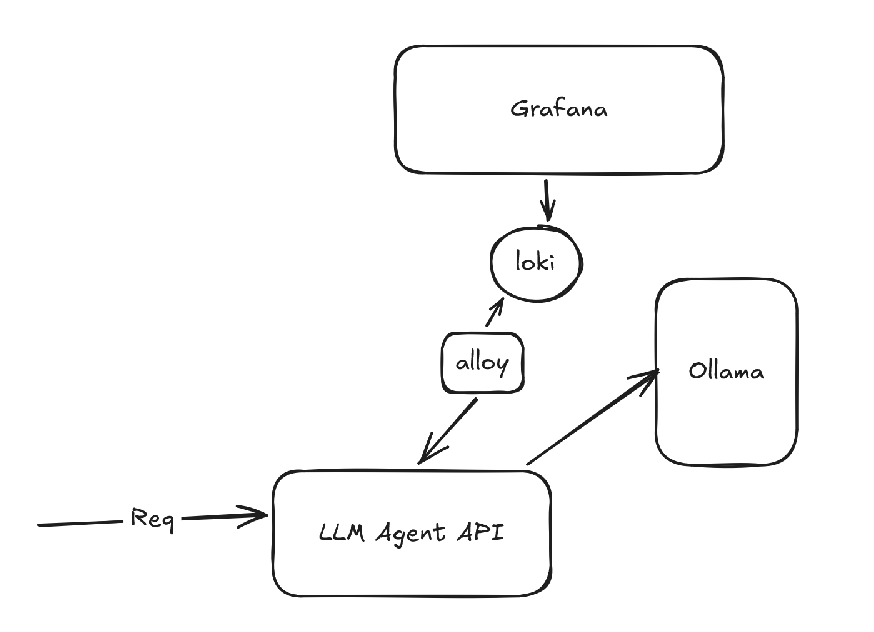

# LLM Agent Go

Production-style backend service that exposes an HTTP API to interact with an LLM engine through a resilient, observable, and testable architecture.

This project is intentionally designed as an engineering showcase: it demonstrates clean architecture, reliability patterns, and observability practices expected in modern backend systems.

## Features

- Clean architecture layering (Domain → Application → Infrastructure)
- LLM abstraction via interface
- Streaming and non-streaming generation
- Circuit breaker protection
- Rate limiting
- Structured logging
- Docker observability stack
- Tests

### Architecture Overview



### Internal

| Layer          | Responsibility                 |
| -------------- | ------------------------------ |
| Application    | Use-cases                      |
| Domain         | llm interface                  |
| Infrastructure | llm integrations + Controllers |

## API Endpoints

### Generate Text

`POST /llm/generate`

Body:

```json
{
  "prompt": "Explain distributed systems"
}
```

Response:

```json
{
  "response": "..."
}
```

### Stream Text
`POST /llm/stream`

Returns streamed chunks as they are generated.

### LLM Health Check
```GET /health/llm```

Returns:
- 200 → LLM reachable
- 500 → LLM unavailable

### Health Check
```GET /health```

## Resilience Strategy

The LLM client is protected by three layers:

### Rate Limiter

Prevents request bursts from overwhelming the model or infrastructure.

### Circuit Breaker

Stops sending requests when failures exceed a threshold.

State machine:
```
Closed → Open → Half-Open → Closed
```
Trip condition:
```
> 3 consecutive failures
```
Purpose:
- protect upstream
- avoid cascading failures
- reduce resource waste

### Context Cancellation

Every request respects context:

- client disconnect → request stops
- timeout → request stops
- upstream cancelled → propagation stops

## Observability

The service emits telemetry from day one.

### Logs

Structured logs (zerolog) written to stdout.

Collected by:
- Loki (log storage)
- Alloy (collector)

## Running Locally

Start stack:
```
make local-docker-start
```
Build and Start:
```
make local-docker-build-and-start
```

NOTE: for the first time after starting he ecosystem you will need to init the model into ollama container using this command: `docker exec -it ollama ollama pull llama3`

Stop:
```
make local-docker-stop
```
Restart:
```
make local-docker-restart
```
Rebuild + start:
```
make local-docker-restart-and-build
```

## Services
| Service | Port  | Purpose       |
| ------- | ----- | ------------- |
| API     | 8080  | main service  |
| LLM     | 11434 | model backend |
| Grafana | 3000  | dashboards    |
| Loki    | 3100  | logs          |

## Environment Variables
| Variable   | Description  |
| ---------- | ------------ |
| OLLAMA_URL | LLM base URL |


## What This Project Demonstrates

This repository is meant to show capability in:

- backend architecture
- distributed system thinking
- fault tolerance
- observability design

## License

MIT
